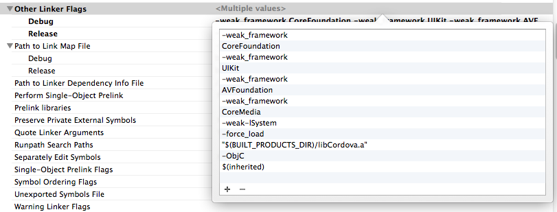

## UIKit frame, bounds 차이

frame은 절대좌표, size  
bounds 는 상대 좌표, size

## 구버전 SDK 대응코드 작성하기

RESPONDSTOSELECTOR 로 기존에 존재하는 메소드인지 확인이 가능하다.

	if ([tableView respondsToSelector:@selector(setSeparatorInset:)]) {
    	[tableView setSeparatorInset:UIEdgeInsetsZero];
	}

## UIViewController 에서 tabbar 나 navigationbar 를 사용하는 view일때 기본설정

UI 를 직접그리는경우 navbar 의 height 를 계산해서 그려야하는데 아래 옵션을 주면 0,0 좌표계로 바로 작업할수있다.

	- (void) viewDidLoad {
    	// 포지셔닝 이옵션을 줘놓으면 navbar, tabbar 상관없이 개발이 가능 IOS7에서만
    	self.edgesForExtendedLayout = UIRectEdgeNone;
	}

## UILabel 그려보기전에 text Size 알아내기

	NSString *price = @"10,550";
	CGSize txtSize = [price sizeWithAttributes:@{NSFontAttributeName:[UIFont systemFontOfSize:18.0f]}];
    // do something

## UIView redraw 

drawRect 와 의존성이 있는 view 의 경우 instance variable을 기준으로 다시그리고 싶을때

	 [view setNeedsDisplay];
     

## NSCoding Boolean decode

## Push Notification 시 인증서만들기


Certificates - APNS for IOS, `apns_xxx.cer`

키체인접근 - 인증서- Apple IOS Push Services 개인키와 얽혀있는 인증서를 내보내기한다.  `key.p12`


### pem 파일 만들기

위의 2 파일로 cert.pem, key.pem 파일을 생성한다.

	$ openssl x509 -in apns_xxx.cer -inform DER -outform PEM -out cert.pem
	$ openssl pkcs12 -in key.p12 -out key.pem -nodes


### 생성된 pem 인증서 확인
	$ openssl s_client -connect gateway.sandbox.push.apple.com:2195 -cert YourSSLCertAndPrivateKey.pem -debug -showcerts -CAfile server-ca-cert.pem

### NodeJs 에서 PUSH 메시지 보내보기

	준비중 

### Cordova + cocoapods 의존성문제 해결하기 

Other Linker Flags에 `$(inherited)` 추가


### view controller status bar 보이지않도록 처리하기 

ViewController 내부에 아래와 같이 구현하면 됨.
```
- (BOOL)prefersStatusBarHidden {
    return YES;
}
```

### NSDictionary Or Array to JSON String

```
NSData *data = [NSJSONSerialization dataWithJSONObject:responseObject options:0 error:nil];
NSString *resultStr =[[NSString alloc] initWithData:data encoding:NSUTF8StringEncoding];
```

Object to Dictionary 편법. NSCoding interface 구현하기가 귀찮을때 아래방식으로
```
- (NSDictionary *)dictionary {
	return @{@"key":self.value, ...};
}
```

### JSON String to NSDictionary Or Array 

```
NSString *jsonString = @"{\"ID\":{\"Content\":268,\"type\":\"text\"},\"ContractTemplateID\":{\"Content\":65,\"type\":\"text\"}}";
NSData *data = [strDict dataUsingEncoding:NSUTF8StringEncoding];
id json = [NSJSONSerialization JSONObjectWithData:data options:0 error:nil];
```

### UIViewController 별 statusbar 설정


```
/**
 * view controller 별 status bar style 설정
 */
- (UIStatusBarStyle) preferredStatusBarStyle {
    return UIStatusBarStyleBlackTranslucent;
}

```

### AFNetworking 2.0.x 에서 HTTP 요청 시 request HEADER 설정

requestSerializer 멤버변수에 꽂아주면 된다 :)
```
    AFHTTPRequestOperationManager *manager = [AFHTTPRequestOperationManager manager];
    [[manager requestSerializer] setValue:obj.sessionKey forHTTPHeaderField:@"Cookie"];
```

## Network programming 관련

Little endian to big endian
```
	int length = 4;
	uint32_t convLen = htonl((uint32_t)length);
```

NSData로 부터 읽을때 endian 변환
```
- (void)socket:(GCDAsyncSocket *)sock didReadData:(NSData *)data withTag:(long)tag {
	int pktlength = CFSwapInt32BigToHost(*(int*)([data bytes]));
	.. do something
}
```
[Byte Order Utilities](https://developer.apple.com/library/mac/documentation/CoreFoundation/Reference/CFByteOrderUtils/Reference/reference.html)


## Cordova 관련 이슈들

cordova 3.2.0 에서 Plugin group에서 클래스를 새로 생성하는경우 잘못된 헤더가 import된다.

```
#import <Cordova/Cordova.h> // 잘못됨
#import <Cordova/CDV.h> // 요형태로 수정필요
```

iOS Archiving 시 `<Cordova/CDV.h>` 못찾는 문제 해결방안 

테스트한 환경 :  Xcode 5, iOS7

이상하게 release build/run, debug build/run 은 되는데 archiving 때만 안되는 케이스를 해결 
```

cordova -d platform add ios 커맨드로 실행되었을때 기본 설정은 
"$(BUILT_PRODUCTS_DIR)/libCordova.a" 인데 이 설정은 잘못되었다. 아래와 같이 설정해주어야함!

Build Settings < Search Paths < Header Search Paths 에 아래 항목을 추가한다. 
"$(OBJROOT)/UninstalledProducts/include"

```

## App Store Link 던지기

[Stackoverflow 답변](http://stackoverflow.com/questions/433907/how-to-link-to-apps-on-the-app-store)
```
// 앱 이름으로
[[UIApplication sharedApplication] openURL:[NSURL URLWithString:@"itms://itunes.com/apps/appname"]];
// 개발자링크
[[UIApplication sharedApplication] openURL:[NSURL URLWithString:@"itms://itunes.com/apps/developername"]];

//회사링크
[[UIApplication sharedApplication] openURL:[NSURL URLWithString:@"itms-apps://itunes.com/apps/DevelopmentCompanyLLC"]];
```

## NSUserDefault 이용한 초간단 local스토리지 사용

```
NSUserDefaults *defaults = [NSUserDefaults standardUserDefaults];


```
[NSDefaults 참고](https://developer.apple.com/library/mac/documentation/Cocoa/Reference/Foundation/Classes/nsuserdefaults_Class/Reference/Reference.html#//apple_ref/occ/instm/NSUserDefaults/persistentDomainForName:)